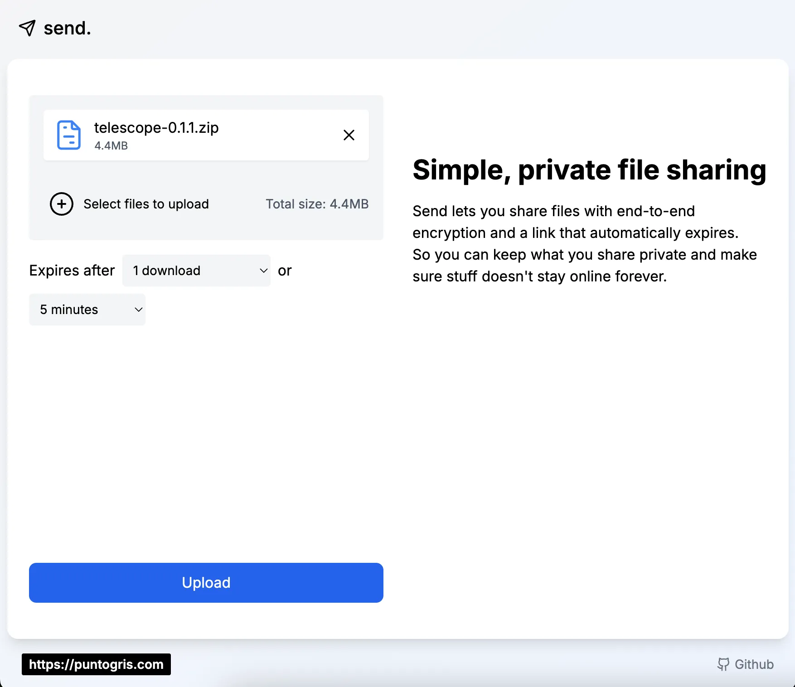
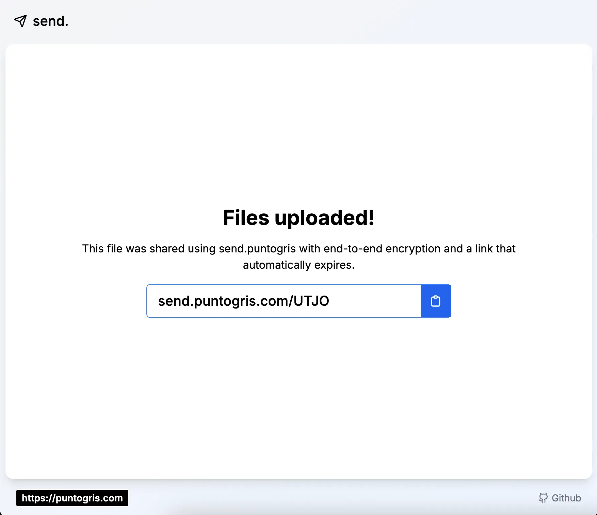
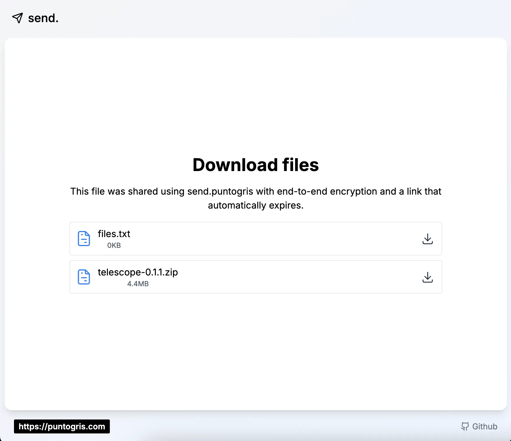

# send

A temporal storage app for personal use, highly inspired by Firefox Send.

Temp TODO's

- [x] Simple auth(local env)
- [x] Remote DB to persist links
- [ ] File encryption
- [x] An s3 compatible storage provider
- [x] Page to see generated links

Future TODO's

- [ ] Mobile app for Android and iOS
- [ ] Migrate to something like Appwrite/Supabase for mobile compatibility and have auth and a DB built in or create an api for all theses features
- [ ] Dark mode
- [ ] Multipart upload

## Screenshots

### Upload your files

### Get the link

### Download the files

